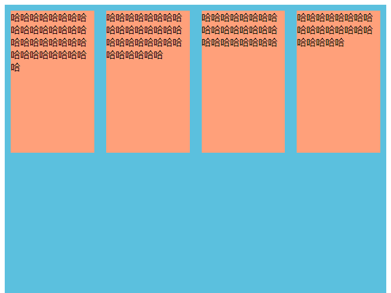
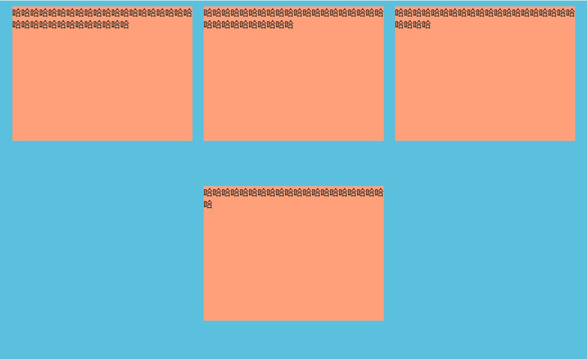
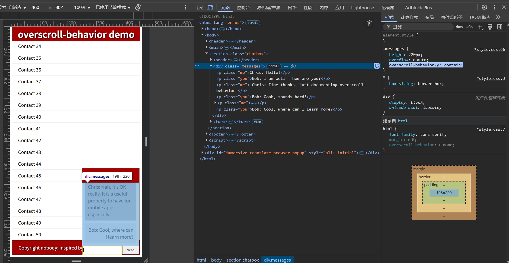

## meta 标签

```html
<meta name="viewport" content="width=device-width, initial-scale=1, maximum-scale=1, user-scalable=no" />
<meta name="viewport" content="width=device-width, initial-scale=1, shrink-to-fit=no">
```


## 弹性布局

| 属性            | 描述                                                         |                                                              |
| --------------- | :----------------------------------------------------------- | ------------------------------------------------------------ |
| flex-direction  | 指定弹性容器中子元素排列方式                                 | [参数](http://www.runoob.com/cssref/css3-pr-flex-direction.html) |
| flex-wrap       | 设置弹性盒子的子元素超出父容器时是否换行                     | [参数](http://www.runoob.com/cssref/css3-pr-flex-wrap.html)  |
| flex-flow       | 复合属性，可以设置多个值，flex-direction 和 flex-wrap 的简写 | [参数](http://www.runoob.com/cssref/css3-pr-flex-flow.html)  |
| align-items     | 设置弹性盒子元素在侧轴（纵轴）方向上的对齐方式               | [参数](http://www.runoob.com/cssref/css3-pr-align-items.html) |
| align-content   | 修改 flex-wrap 属性的行为，类似 align-items，但不是设置子元素对齐，而是设置行对齐 | [参数](http://www.runoob.com/cssref/css3-pr-align-content.html) |
| justify-content | 设置弹性盒子元素在主轴（横轴）方向上的对齐方式               | [参数](http://www.runoob.com/cssref/css3-pr-justify-content.html) |

>   **Eg:** 

```css
.container {
    display: flex;	/* 柔性 */
    /*flex-direction: row;
    flex-wrap: wrap;*/	/* 是否换行 */
    flex-flow: row;		/* 符合属性  row | wrap */
    justify-content: center;	/*盒子居中对齐*/
    height: 640px;
    background-color: #5bc0de;
}
.item {
    width: 320px;
    height: 240px;
    margin: 10px;
    background-color: lightsalmon;
}
```



```css
.container {
    display: flex;
    /*flex-direction: row;
    flex-wrap: wrap;*/
    flex-flow: wrap;
    height: 640px;
    background-color: #5bc0de;
    justify-content: center;
}
```



```html
<div class="container">
	<div class="item">哈哈哈哈哈哈哈哈哈哈哈哈哈哈哈哈哈哈哈哈哈哈哈哈哈哈哈哈哈哈哈哈哈</div>
	<div class="item">哈哈哈哈哈哈哈哈哈哈哈哈哈哈哈哈哈哈哈哈哈哈哈哈哈哈哈哈哈哈</div>
	<div class="item">哈哈哈哈哈哈哈哈哈哈哈哈哈哈哈哈哈哈哈哈哈哈哈哈</div>
	<div class="item">哈哈哈哈哈哈哈哈哈哈哈哈哈哈哈哈哈哈哈哈哈</div>
</div>
```


```html
<!DOCTYPE html>
<html>
    <head>
        <meta charset="UTF-8">
        <title>Title</title>
        <style>
            * {
                margin: 0;
                padding: 0;
            }

            .container {
                display: flex;
                flex-flow: column;
                align-items: center;
                background-color: #5bc0de;
            }

            .item {
                display: flex;
                flex-flow: column;
                align-items: center;		/*上下居中*/
                justify-content: center;	/*左右居中*/
                width: 320px;
                height: 200px;
                margin: 10px;
                background-color: #ffa07a;
            }

            .item-content {
                display: flex;
                align-items: center;	/*上下居中*/
                justify-content: center;	/*左右居中*/
                width: 100px;
                height: 100px;
                background: #ffffff;
                color: #000000;
            }
        </style>
    </head>
    <body>
        <div class="container">
            <div class="item">
                <div class="item-content">
                    哈哈哈哈哈哈哈哈哈哈哈哈哈哈
                </div>
                <div class="item-content" style="background: #8c8c8c">
                    哈哈哈哈哈哈哈哈哈哈哈哈哈哈哈
                </div>
            </div>
            <div class="item">
                <div class="item-content">
                    哈哈哈哈哈哈哈哈哈哈哈哈哈哈哈
                </div>
            </div>
            <div class="item">
                <div class="item-content">
                    哈哈哈哈哈哈哈哈哈哈哈哈哈哈哈
                </div>
            </div>
            <div class="item">
                <div class="item-content" style="width: 200px;">
                    哈哈哈哈
                </div>
            </div>
        </div>
    </body>
</html>
```


## 通用**CSS**弹性布局样式

```css
.d-flex {
	display: -webkit-box !important;
	display: -ms-flexbox !important;
	display: flex !important;
}

.flex-row {
	-webkit-box-orient: horizontal !important;
	-webkit-box-direction: normal !important;
	-ms-flex-direction: row !important;
	flex-direction: row !important;
}

.flex-column {
	-webkit-box-orient: vertical !important;
	-webkit-box-direction: normal !important;
	-ms-flex-direction: column !important;
	flex-direction: column !important;
}

.flex-wrap {
	-ms-flex-wrap: wrap !important;
	flex-wrap: wrap !important;
}

.flex-nowrap {
	-ms-flex-wrap: nowrap !important;
	flex-wrap: nowrap !important;
}

.justify-content-start {
	-webkit-box-pack: start !important;
	-ms-flex-pack: start !important;
	justify-content: flex-start !important;
}

.justify-content-end {
	-webkit-box-pack: end !important;
	-ms-flex-pack: end !important;
	justify-content: flex-end !important;
}

.justify-content-center {
	-webkit-box-pack: center !important;
	-ms-flex-pack: center !important;
	justify-content: center !important;
}

.justify-content-between {
	-webkit-box-pack: justify !important;
	-ms-flex-pack: justify !important;
	justify-content: space-between !important;
}

.justify-content-around {
	-ms-flex-pack: distribute !important;
	justify-content: space-around !important;
}

.align-items-start {
	-webkit-box-align: start !important;
	-ms-flex-align: start !important;
	align-items: flex-start !important;
}

.align-items-end {
	-webkit-box-align: end !important;
	-ms-flex-align: end !important;
	align-items: flex-end !important;
}

.align-items-center {
	-webkit-box-align: center !important;
	-ms-flex-align: center !important;
	align-items: center !important;
}

/*提取版*/
.d-flex {
	display: flex;
}

.flex-row {
	flex-direction: row;
}

.flex-column {
	flex-direction: column;
}

.flex-wrap {
	flex-wrap: wrap;
}

.flex-nowrap {
	flex-wrap: nowrap;
}

.justify-content-start {
	justify-content: flex-start;
}

.justify-content-end {
	justify-content: flex-end;
}

.justify-content-center {
	justify-content: center;
}

.justify-content-between {
	justify-content: space-between;
}

.justify-content-around {
	justify-content: space-around;
}

.align-items-start {
	align-items: flex-start;
}

.align-items-end {
	align-items: flex-end;
}

.align-items-center {
	align-items: center;
}

.position-relative {
	position: relative;
}

.position-fixed {
	position: fixed;
}

.position-absolute {
	position: absolute;
}

.bg-white {
    background-color: #ffffff;
}

.bg-black {
    background-color: #000000;
}

.f-white {
    color: #ffffff;
}

.f-black {
    color: #000000;
}

.w-100 {
    width: 100%;
}

.h-100 {
    height: 100%;
}

.text-overflow-hidden {
	overflow: hidden; /* 隐藏溢出部分 */
	text-overflow: ellipsis; /* 显示省略符号来代表被隐藏的文本 */
	white-space: nowrap;	/* 单行使用这个 */
}

.text-overflow-row-hidden {
	overflow: hidden; /* 隐藏溢出部分 */
	text-overflow: ellipsis; /* 显示省略符号来代表被隐藏的文本 */
	display: -webkit-box !important; /* 将对象作为弹性伸缩盒子模型显示 */
	-webkit-box-orient: vertical; /* 设置盒子内排列顺序为纵向 */
	-webkit-line-clamp: 2; /* 限制块元素显示的文本的行数 */
}

.cursor-pointer {
	cursor: pointer;
}
```


## 符号速查表

|          |      |
| -------- | ---- |
| &middot; |      |
| &copy;   |      |
| &nbsp;   | 空格 |
| &lt;     |      |
| &gt;     |      |
| &ge;     |      |
| &le;     |      |
| &plusmn; |      |
| &minus;  |      |
| &divide; |      |
| &times;  |      |
| &sup2;   | 上标 |
|          |      |

## 过渡动画

#### MDUI

```css
transition: all .3s cubic-bezier(0, 0, 0.2, 1);
```

#### Bootstrap

```css
transition:width .6s ease;  /*适用于进度条*/
```

#### GitHub

```css
@media (max-width: 1011px)
	.site-navigation {
		width: 100%;
		position: fixed;
		height: 100%;
		top: 0;
		right: 0;
		z-index: 9;
		background: #111416;
		-webkit-transition: -webkit-transform 1s cubic-bezier(.16,1,.3,1);
		transition: -webkit-transform 1s cubic-bezier(.16,1,.3,1);
		transition: transform 1s cubic-bezier(.16,1,.3,1);
		transition: transform 1s cubic-bezier(.16,1,.3,1),-webkit-transform 1s cubic-bezier(.16,1,.3,1);
		-webkit-transform: translate3d(100%,0,0);
		transform: translate3d(65%,0,0);
		overflow-y: auto;
		display: none;
	}
```


## `position`定位（粘性布局）

```html
<!DOCTYPE html>
<html>
<head>
	<meta charset="utf-8">
	<title>菜鸟教程(runoob.com)</title>
	<style>
		div.sticky {
			position: -webkit-sticky;
			position: sticky;
			top: 0;
			padding: 5px;
			background-color: #cae8ca;
			border: 2px solid #4CAF50;
		}
	</style>
</head>
<body>
    <p>尝试滚动页面。</p>
    <p>注意: IE/Edge 15 及更早 IE 版本不支持 sticky 属性。</p>
    <div class="sticky">我是粘性定位!</div>
    <div style="padding-bottom:2000px">
        <p>滚动我</p>
        <p>来回滚动我</p>
    </div>
</body>
</html>
```

## HTML代码缩写

####  嵌套： `>`

>   使用`>`运算符将元素嵌套在彼此内：


```html
div>ul>li
```

```html
<div>
    <ul>
        <li></li>
    </ul>
</div>
```

#### 加法： `+`

>   使用`+`运算符将元素放在彼此附近，在同一级别上：

```html
div+p+p
```

```html
<div></div>
<p></p>
<p></p>
```

#### 上级： `^`

>   使用`^`运算符，您可以爬上树的一个级别并更改应显示以下元素的上下文：

```html
div+div>p>span^em == div+div>(p>span)+em	/*两者相等*/
```

```html
<div></div>
<div>
    <p><span></span></p>
    <em></em>
</div>

div+div>p>span+em^^^div
<div></div>
<div>
    <p><span></span><em></em></p>
</div>
<div></div>
```

#### 乘法： `*`

>   使用`*`运算符，您可以定义元素的输出次数：

```html
ul>li*5
```

```html
<ul>
    <li></li>
    <li></li>
    <li></li>
    <li></li>
    <li></li>
</ul>
```

#### 括号： `()`

>   Emmets的超级用户使用括号内容对复杂缩写中的子树进行分组：

```html
div>(header>ul>li*2>a)+footer>p
```

```html
<div>
    <header>
        <ul>
            <li><a href=""></a></li>
            <li><a href=""></a></li>
        </ul>
    </header>
    <footer>
        <p></p>
    </footer>
</div>
```

```html
(div>dl>(dt+dd)*3)+footer>p
```

```html
<div>
    <dl>
        <dt></dt>
        <dd></dd>
        <dt></dt>
        <dd></dd>
        <dt></dt>
        <dd></dd>
    </dl>
</div>
<footer>
    <p></p>
</footer>
```

#### 属性运算符: ID和CLASS

>   在CSS中，您使用`elem#id`和`elem.class`表示法来访问具有指定`id`或`class`属性的元素。在Emmet中，您可以使用相同的语法*将*这些属性*添加*到指定的元素：

```html
div#header+div.page+div#footer.class1.class2.class3
```

```html
<div id="header"></div>
<div class="page"></div>
<div id="footer" class="class1 class2 class3"></div>
```

#### 物品编号： `#### 

>   使用乘法`*`运算符，您可以重复元素，但`$`您可以对它们进行*编号*。将`$`运算符放在元素的名称，属性的名称或属性的值中，以输出重复元素的当前数量：

```html
ul>li.item$*5
可以$连续使用多个用零填充数字：ul>li.item$$$*5
```

```html
<ul>
    <li class="item1"></li>
    <li class="item2"></li>
    <li class="item3"></li>
    <li class="item4"></li>
    <li class="item5"></li>
</ul>

<ul>
    <li class="item001"></li>
    <li class="item002"></li>
    <li class="item003"></li>
    <li class="item004"></li>
    <li class="item005"></li>
</ul>
```

#### 文本： `{}`

>   使用花括号将元素添加到元素：

```html
a{Click me}

```

```html
<a href="">Click me</a>
```

## Chrome for Android

### 设置顶栏主题颜色

```html
<meta name="theme-color" content="#db5945">
```

### 图标和磁贴

>   当用户访问您的网页时，浏览器会尝试从 HTML 提取图标。图标可能出现在许多地方，包括浏览器标签、最近的应用切换、新的（或最近访问的）标签页面等。提供高质量的图像将使您的网站更具辨识度，让用户更容易发现您的网站。为充分支持所有浏览器，您需要向每个页面的 `<head>` 元素添加几个标记。

```html
<!-- icon in the highest resolution we need it for -->
<link rel="icon" sizes="192x192" href="icon.png">

<!-- reuse same icon for Safari -->
<link rel="apple-touch-icon" href="ios-icon.png">

<!-- multiple icons for IE -->
<meta name="msapplication-square310x310logo" content="icon_largetile.png">
```

### Chrome 和 Opera

>   Chrome 和 Opera 均使用 `icon.png`，图标将被缩放到设备所需的大小。 为防止自动缩放，您还可以通过指定 `sizes` 属性另外提供尺寸。

**Note:** 图标大小应基于 48px，例如 48px、96px、144px 和 192px

### 修改 input placeholder 文字颜色

```css
::-webkit-input-placeholder {
  color: red;
}
:-moz-placeholder {/* Firefox 18- */
  color: red;
}
::-moz-placeholder{/* Firefox 19+ */
 color: red;
}
:-ms-input-placeholder {
  color: red;
}
```

## 滚动条样式

```css
/*定义滚动条高宽及背景高宽分别对应横竖滚动条的尺寸*/
&::-webkit-scrollbar {
    width: 10px;
    height: 3px;
}

/*定义滑块颜色+圆角*/
&::-webkit-scrollbar-thumb {
    border-radius: 10px;
    background-color: rgba(144, 147, 153, .3);
    cursor: pointer;
}

/*定义滚动条轨道内阴影+圆角*/
&::-webkit-scrollbar-track {
    border-radius: 10px;
    background-color: #ffffff;
}

&::-webkit-scrollbar-button {
    display: none;
}
```

## 按钮 伪类

```css
@media (min-width: 576px) {
    .mr-sm-2, .mx-sm-2 {
        margin-right: .5rem !important;
    }
}

.custom-control-input {
    position: absolute;
    z-index: -1;
    opacity: 0;
}

.custom-control-label::before {
    position: absolute;
    top: .25rem;
    left: 0;
    display: block;
    width: 1rem;
    height: 1rem;
    pointer-events: none;
    content: "";
    -webkit-user-select: none;
    -moz-user-select: none;
    -ms-user-select: none;
    user-select: none;
    background-color: #dee2e6;
}

.custom-control-label::after {
    position: absolute;
    top: .25rem;
    left: 0;
    display: block;
    width: 1rem;
    height: 1rem;
    content: "";
    background-repeat: no-repeat;
    background-position: center center;
    background-size: 50% 50%;
}

.custom-control {
    position: relative;
    display: block;
    min-height: 1.5rem;
    padding-left: 1.5rem;
}

.custom-checkbox .custom-control-input:checked ~ .custom-control-label::after {
    background-image: url("data:image/svg+xml;charset=utf8,%3Csvg xmlns='http://www.w3.org/2000/svg' viewBox='0 0 8 8'%3E%3Cpath fill='%23fff' d='M6.564.75l-3.59 3.612-1.538-1.55L0 4.26 2.974 7.25 8 2.193z'/%3E%3C/svg%3E");
}

.custom-checkbox .custom-control-input:checked ~ .custom-control-label::before {
    background-color: #007bff;
}

.custom-checkbox .custom-control-label::before {
    border-radius: .25rem;
}
```

```html
<div class="custom-control custom-checkbox mr-sm-2">
   <input type="checkbox" class="custom-control-input" id="customControlAutosizing">
   <label class="custom-control-label" for="customControlAutosizing">单选多选按钮</label>
</div>
```

## 箭头

```css
.right-arrow {
	display :inline-block;
	position: relative;
	width: 36rpx;
	height: 36rpx;
	margin: 0 20rpx;
}

.right-arrow::after {
	display: inline-block;
	content: '';
	height: 18rpx;
	width: 18rpx;
	border-width: 4rpx 4rpx 0 0;
	border-color: #57B4ED;
	border-style: solid;
	transform: rotate(45deg);
	position: absolute;
	top: 50%;
	right: 6rpx;
	margin-top: -9rpx;
}
```

## 超出文本隐藏

```css
.text-overflow-ellipsis {
	display: block !important;
	white-space: nowrap !important;
	text-overflow: ellipsis !important;
	overflow: hidden !important;
}

.text-overflow-line-ellipsis {
	overflow: hidden; /* 隐藏溢出部分 */
	text-overflow: ellipsis; /* 显示省略符号来代表被隐藏的文本 */
	display: -webkit-box !important; /* 将对象作为弹性伸缩盒子模型显示 */
	-webkit-box-orient: vertical; /* 设置盒子内排列顺序为纵向 */
	-webkit-line-clamp: 2; /* 限制块元素显示的文本的行数 */
}
```

## 苹果毛玻璃

```css
-webkit-backdrop-filter: saturate(180%) blur(20px);
backdrop-filter: saturate(180%) blur(20px);
background-color: rgba(255,255,255,0.7);
```

## 微软输入框样式

```css
border-bottom: 2px solid var(--cr-input-focus-color);
border-radius: var(--cr-input-underline-border-radius, 0);
bottom: 0;
box-sizing: border-box;
display: var(--cr-input-underline-display);
height: var(--cr-input-underline-height, 0);
left: 0;
margin: auto;
opacity: 1;
position: absolute;
right: 0;
transition: opacity 120ms ease-out, width 0s linear 180ms;
width: 100%;
```

## 动画优化

#### will-change

> https://developer.mozilla.org/zh-CN/docs/Web/CSS/will-change

[CSS](https://developer.mozilla.org/zh-CN/docs/Web/CSS) 属性 `will-change` 为 web 开发者提供了一种告知浏览器该元素会有哪些变化的方法，这样浏览器可以在元素属性真正发生变化之前提前做好对应的优化准备工作。这种优化可以将一部分复杂的计算工作提前准备好，使页面的反应更为快速灵敏。

### 渐变文字

```css
background: linear-gradient(180deg, #fff, #ffffff4f);
background-clip: text;
-webkit-background-clip: text;
-webkit-text-fill-color: transparent;
```

### 渐变按钮

```css
background: radial-gradient(141.42% 141.42% at 100% 0%, #fff6, #fff0), radial-gradient(140.35% 140.35% at 100% 94.74%, #bd34fe, #bd34fe00), radial-gradient(89.94% 89.94% at 18.42% 15.79%, #41d1ff, #41d1ff00);
box-shadow: 0 1px #ffffffbf inset;
```

## overscroll-behavior

**`overscroll-behavior`** CSS 属性是 [`overscroll-behavior-x`](https://developer.mozilla.org/zh-CN/docs/Web/CSS/overscroll-behavior-x) 和 [`overscroll-behavior-y`](https://developer.mozilla.org/zh-CN/docs/Web/CSS/overscroll-behavior-y) 属性的合并写法，让你可以控制浏览器过度滚动时的表现——也就是滚动到边界。

```css
/* 关键字的值 */
overscroll-behavior: auto; /* 默认 */
overscroll-behavior: contain;
overscroll-behavior: none;

/* 使用 2 个值 */
overscroll-behavior: auto contain;

/* Global values */
overflow: inherit;
overflow: initial;
overflow: unset;
```

### [值](https://developer.mozilla.org/zh-CN/docs/Web/CSS/overscroll-behavior#值)

- [`auto`](https://developer.mozilla.org/zh-CN/docs/Web/CSS/overscroll-behavior#auto)

  默认效果

- [`contain`](https://developer.mozilla.org/zh-CN/docs/Web/CSS/overscroll-behavior#contain)

  设置这个值后，默认的滚动边界行为不变（“触底”效果或者刷新），但是临近的滚动区域不会被滚动链影响到，比如对话框后方的页面不会滚动。

- [`none`](https://developer.mozilla.org/zh-CN/docs/Web/CSS/overscroll-behavior#none)

  临近滚动区域不受到滚动链影响，而且默认的滚动到边界的表现也被阻止。


