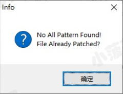
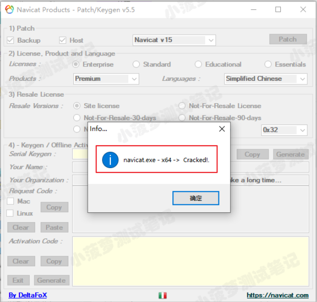
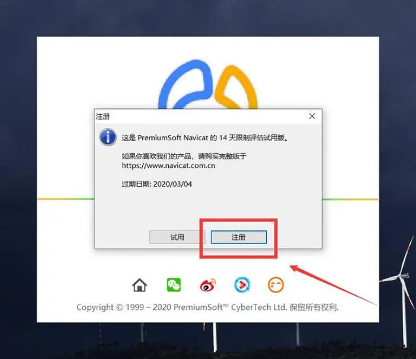
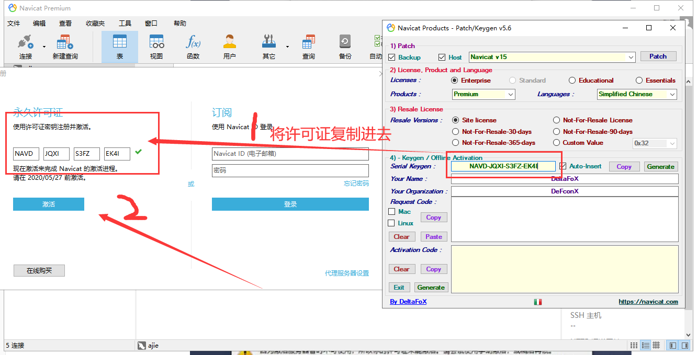

## Navicat Premium 15 破解教程

### 1.断网使用注册机（激活时必须断网）

> 先退出所有杀毒软件，再打开注册机，否则会一直报错的




### 2. 破解 navicat.exe

> **在激活工具的第一个选项(1.Patch)里选择Backup，Host，Navicat 是那个版本就选那个版本，这里就选择Navicat V 15 就好了，然后点击，Patch按钮，选择Navicat的安装位置中的navicat.exe文件**

> 如图：


> **出现以下提示说明Patch成功了。**




### 3.License. Product and Language

> **License里选中Enterprise、在Produce里选择Premium、在Languages里选择Simplified Chinese(简体中文)**


### 4.Resale License

> **选择Site License**


### 5.Keygen / Offline Activation

> 点击Generate按钮就会生成一个许可证秘钥，将许可证秘钥复制后就打开Navicat Premium 15


### 6.打开Navicat Premium 15，点击注册




### 7.粘贴秘钥，然后点击**激活**按钮




### 8.在弹出的界面选择手动激活


### 9.将请求码粘贴到注册机Request Code框中


### 10.点击激活页面的激活弹出（说明激活成功）


## idea 破解教程

### 1. 添加存储库

```
https://plugins.zhile.io
```

### 2.搜索该插件安装

```
IDE Eval Reset
```


